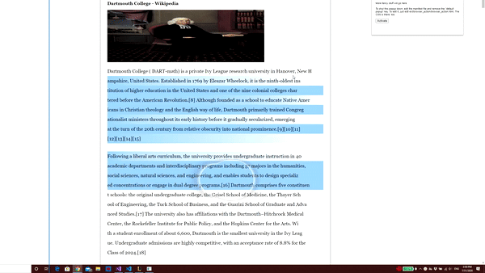

# GARB: Gaze-Aware Reading-aid for the Browser

### What is GARB?
GARB stands for "Gaze-Aware Reading-aid for the Browser," which allows users to track their online reading through an eye tracking device.
Through the use of an extension to simplify webpages and get rid of distracting elements (ads, primarily), users will have less distractions when reading.
There is also highlighting of lines to track user progress and collect data on the user's reading ability.

### GARB Demo

### Requirements
1. Software requirements:
    * Visual Studios 2019 (https://visualstudio.microsoft.com/downloads/)
    * Google Chrome Browser
2. Hardware requirements:
    * Tobii 4C/5 Eyetracking device (https://gaming.tobii.com/product/tobii-eye-tracker-4c/)

### Setup
1. Clone the repo locally and open it with Visual Studios.
1. Activate the extension
    * go to `chrome://extensions` and load the extension by clicking `Load Unpacked`, and selecting/opening the `extension` folder/directory in the repo.
1. Install either: https://github.com/garb-browser/garb-gaze-events-service-mac on a mac or https://github.com/garb-browser/garb-gaze-events-service-windows
      
### How To Run:
1. Make sure all the steps from __Setup__ are followed!
2. Turn on Tobii Eyetracking and calibrate.
3. Start the gaze-events-service
5. Now open up a webpage, use the extension on it, and you should see lines of text being highlighted in blue from your eye movement!
